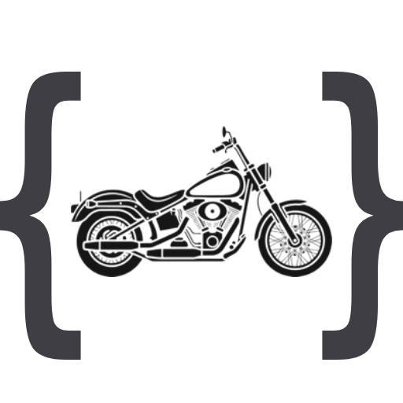

<p align="center">
  <picture>
    <source media="(prefers-color-scheme: dark)" srcset="docs/logo-dark.png">
    
  </picture>
</p>

# moto-kr

한국에서 인증된 이륜차의 모델명, 제원, 인증 이력을 조회하는 오픈소스 API입니다.

한국에 정식 발매된 오토바이 기종을 조회할 API가 필요했지만 찾을 수 없어 직접 만들었습니다.

국내에 이륜차를 출시할 때는 [배출가스·소음 등 해당 차량에 적용되는 인증](https://kencis.me.go.kr/new_kencis/hms/bi01/hmsbi01b02.do)을 거칩니다. 이 과정에서 차명과 형식, 제작·수입사 정보가 남기 때문에, 인증 기록을 판매 모델별로 정리하면 국내 정발 기종 목록의 바탕으로 쓸 수 있습니다.

KENCIS 배출가스·소음 인증에 쓰인 차명을 국내에서 사용하는 모델명과 연결했습니다. 배기량, 차종, 브랜드 등으로 검색할 수 있으며, 같은 모델의 인증 이력을 함께 제공합니다.

## API

기본 주소는 `https://moto-kr.starhn87.workers.dev`입니다. API 키가 필요하지 않으며, CORS를 허용하므로 브라우저에서도 호출할 수 있습니다.

```text
GET /models                                  # 전체 데이터 (인증 이력 포함)
GET /models?category=크루저&ccMin=800          # 조건에 맞는 모델 (요약 형식)
GET /brands                                  # 브랜드 목록과 기종 수
GET /meta                                    # 데이터 생성일과 집계
```

`/models`는 파라미터 없이 호출하면 전체 데이터를 반환합니다. 필터나 페이징 파라미터를 지정하면 개별 인증 이력 대신 인증 건수와 업체 목록을 담은 요약 응답을 반환합니다.

### 필터 파라미터

| 파라미터 | 설명 |
|---|---|
| `brand`, `category` | 콤마로 복수 지정 (예: `brand=혼다,야마하`) |
| `ccMin`, `ccMax` | 배기량 범위 (cc) |
| `from`, `to` | 최초 인증일 범위 (`2020`, `2020-06`, `2020-06-01`) |
| `cylinders` | 기통수, 콤마로 복수 지정 |
| `cooling` | `air` / `liquid` / `oil` |
| `fuelGrade` | `regular` / `premium` |
| `emission` | `euro5` / `euro4` / `euro3` |
| `seatHeightMin`, `seatHeightMax` | 시트고 범위 (mm) |
| `weightMin`, `weightMax` | 중량 범위 (kg) |
| `fuelCapacityMin`, `fuelCapacityMax` | 연료탱크 용량 범위 (L) |
| `powerMin`, `powerMax` | 최고출력 범위 (PS) |
| `electric` | 전기 구동 여부: `true` / `false` |
| `status` | 인증 연결 여부: `verified` / `curated` |
| `q` | 모델명·인증 차명 검색 |
| `limit`, `offset` | 반환할 모델 수, 건너뛸 모델 수 |

예를 들어 `ccMax=125`는 배기량이 125cc 이하인 모델을 조회합니다. 지원하지 않는 파라미터, 잘못된 숫자·날짜, 허용 목록에 없는 값에는 `400`을 반환합니다.

### 정적 JSON 파일

API 대신 [jsDelivr CDN](https://cdn.jsdelivr.net/gh/starhn87/moto-kr@main/data/)에서 파일을 직접 받을 수도 있습니다.

| 파일 | 내용 |
|---|---|
| `models.json` | 전체 모델과 인증 이력 |
| `models.lite.json` | 인증 건수·업체 목록을 포함한 모델 요약 |
| `models.min.json` | 모델명 배열 |
| `unmapped.json` | 미매핑·모호한 차명과 매핑 제외 항목 |

`@main` 주소는 CDN 캐시 때문에 저장소의 변경 사항이 늦게 반영될 수 있습니다. 특정 버전이 필요하면 `@main`을 커밋 해시나 태그로 바꾸세요. 모델 전체가 필요하지 않으면 API의 필터와 `limit`, `offset`을 사용하면 됩니다.

### 응답 예시 (models.json)

아래는 응답 구조를 보여주기 위한 예시입니다. 현재 기종 수와 데이터 생성일은 `/meta`에서 확인할 수 있습니다.

```jsonc
{
  "meta": {
    "generatedAt": "2026-07-17",
    "source": "KENCIS 자동차 배출가스·소음 인증 (data.go.kr 15000988)",
    "counts": { "models": 1142, "verified": 984, "curated": 158, "certifications": 4921, "unmapped": 14, "ambiguous": 0, "excluded": 12 }
  },
  "models": [
    {
      "nameKo": "혼다 CBR650R",
      "brand": "혼다",
      "model": "CBR650R",
      "displacement": 649,
      "category": "스포츠",
      "electric": false,
      "fuelGrade": "regular",
      "seatHeight": 810,
      "weight": 208,
      "cylinders": 4,
      "cooling": "liquid",
      "fuelCapacity": 15.4,
      "power": 95,
      "emissionStandard": "euro5",
      "status": "verified",
      "aliases": ["CBR650RA", "CBR650RAC"],
      "firstCertifiedAt": "2018-12-12",
      "lastCertifiedAt": "2024-04-12",
      "certifications": [
        {
          "no": "JMC-HK-8",
          "date": "2018-12-12",
          "office": "혼다코리아(주)",
          "vehNm": "CBR650RA",
          "vehType": "RH01",
          "fuel": "휘발유(Gasoline)",
          "gubun": "import"
        }
        // 같은 모델에 연결된 다른 인증 이력이 이어집니다
      ]
    }
  ]
}
```

| 필드 | 설명 |
|---|---|
| `nameKo` | 한글 통용 표기. 브랜드 + 모델명 |
| `brand` / `model` | 브랜드명 / 모델명 |
| `displacement` | 실배기량(cc). 전기는 null |
| `category` | 스포츠/네이키드/크루저/투어러/어드벤처/스쿠터/언더본/오프로드/클래식/미니/3륜/4륜 |
| `electric` | 전기 구동 여부 |
| `fuelGrade` | `regular`(일반유) / `premium`(고급유 권장). 제조사 매뉴얼 기준 |
| `seatHeight` / `weight` | 시트고(mm), 중량(kg) |
| `cylinders` / `cooling` | 기통수, 냉각(`air`/`liquid`/`oil`) |
| `fuelCapacity` / `power` | 연료탱크(L), 최고출력(PS) |
| `emissionStandard` | `euro3`/`euro4`/`euro5`. 최신 인증의 배출허용기준 등을 바탕으로 분류 |
| `status` | `verified`: 인증 이력이 연결됨 / `curated`: 별도 자료로 정리했으며 인증 이력은 연결되지 않음 |
| `aliases` | 같은 기종으로 연결하는 차명·코드 표기 |
| `firstCertifiedAt` / `lastCertifiedAt` | 최초·최근 인증일. 출시일이나 판매 종료일과는 다름 |
| `certifications[].no` | 인증번호 |
| `certifications[].office` | 인증을 받은 업체명 |
| `certifications[].vehNm` / `vehType` | 인증 차명과 형식 |
| `certifications[].gubun` | `import`(수입제작차) / `domestic`(국내제작차) |

### 미매핑 목록 (unmapped.json)

[unmapped.json](https://cdn.jsdelivr.net/gh/starhn87/moto-kr@main/data/unmapped.json)은 인증 차명 중 모델을 확정하지 못했거나 매핑 대상에서 제외한 항목을 담습니다. API 엔드포인트가 아닌 정적 파일입니다. 아래는 각 목록의 형식 예시이며 현재 목록과는 다를 수 있습니다.

```jsonc
{
  "unmapped": [
    { "vehNm": "마이크로레이서", "office": "(주)라라클래식모터스", "brandHint": null, "count": 2, "lastDate": "2026-07-09" }
  ],
  // 후보 모델이 여러 개여서 확정하지 못한 항목
  "ambiguous": [
    { "vehNm": "엑시브", "office": "케이알모터스(주)", "candidates": ["KR모터스 엑시브250N", "KR모터스 엑시브250R"], "count": 2, "lastDate": "2014-08-27" }
  ],
  // 자리표시자·시험 등록 등 매핑 대상에서 제외한 항목
  "excluded": [
    { "vehNm": "동일차_1", "office": "디에스글로벌", "count": 2, "lastDate": "2019-03-04", "reason": "KENCIS 자리표시자" }
  ]
}
```

CI는 원본 인증 행 수가 모델에 연결된 인증 수와 `unmapped`·`ambiguous`·`excluded`의 `count` 합계를 더한 값과 일치하는지 검사합니다.

## 데이터 출처와 범위

[공공데이터포털의 KENCIS 배출가스·소음 인증 데이터](https://www.data.go.kr/data/15000988/openapi.do)를 수집합니다. 인증 차명은 판매명과 다를 수 있습니다. 예를 들어 골드윙은 `GL1800`, 하야부사는 `GSX1300BKA` 같은 코드로 등록돼 있습니다. `mapping/`에서 이런 표기를 모델명과 연결하고, 여러 인증 이력을 모델 단위로 묶습니다.

- 현재 수집 범위는 2006년 이후 인증 자료입니다. 이전 기종이나 API에서 조회되지 않는 기종은 별도 자료를 확인해 추가합니다.
- 인증 목록에는 병행수입 차량과 실제 판매 여부를 확인하지 못한 차량도 포함됩니다. 국내 정식 판매 기종을 빠짐없이 수록한 목록은 아닙니다.
- `verified`는 인증 이력이 연결됐다는 뜻입니다. 모든 제원이 검증됐거나 현재 판매 중임을 뜻하지는 않습니다.
- 제원을 확인하지 못한 필드는 `null`로 둡니다. 연식·트림별 차이가 있으므로 개별 차량의 사양과 다를 수 있습니다.

## 라이선스

- 코드: [MIT](LICENSE)
- 인증 원본(`data/raw/`): [공공데이터포털 15000988](https://www.data.go.kr/data/15000988/openapi.do) (환경부·국립환경과학원)
- 매핑·정제 데이터: [CC BY 4.0](https://creativecommons.org/licenses/by/4.0/deed.ko). 사용 시 출처를 moto-kr로 표기해 주세요.
